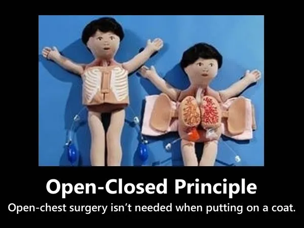

# Open/Closed Principle

***"Software entities (classes, modules, functions, etc.) should be open for extension, closed for modification."***  
It means we should be able to add new functionalities to the existing software system without modifying the existing codebase. Let's progress with the Coffee Machine example. We write every process underneath the related if statement.



```Python
class CoffeeMachine:
    def make_coffee(self, coffee_type):
        if coffee_type == "espresso":
            ...
        elif coffee_type == "americano":
            ...
        elif coffee_type == "latte":
            ...
```

Ask yourself: what if I want to add `mocha`? Should I open and refactor the class? This approach forces us to modify the `CoffeeMachine` class every time a new coffee type is introduced.  
OCP violation: New Feature = Changing the existing class

Let's make it suitable for Open/Closed Principle

```Python
from abc import ABC, abstractmethod

class Coffee(ABC):
    @abstractmethod
    def brew(self):
        pass


class Espresso(Coffee):
    def brew(self):
        ...


class Mocha(Coffee):
    def brew(self):
        ...


class CoffeeMachine:
    def make_coffee(self, coffee: Coffee):
        coffee.brew()
```

With this approach, we utilize abstract class structure. `CoffeeMachine` is not interested in which coffee type it uses. It only cares about `.brew()` functionality of the Coffee object (see: **Decoupling**). Now, to add `Mont Blanc`, we simply create a new `Mont Blanc` class inheriting from `Coffee`, without touching the `CoffeeMachine` at all. We just inject the coffee dependency into the `make_coffee` method (see: **Dependency Injection**).

To wrap up: Instead of modifying the `CoffeeMachine` class, we now extend the system by adding new classes. This is the essence of OCP: **Minimize the risk of breaking existing, working code while introducing new features.**

## Sources

- https://stackify.com/solid-design-open-closed-principle/
- https://www.freecodecamp.org/news/open-closed-principle-solid-architecture-concept-explained/
- https://medium.com/@peterlee2068/software-design-principles-every-programmer-should-know-c164a83c6f87