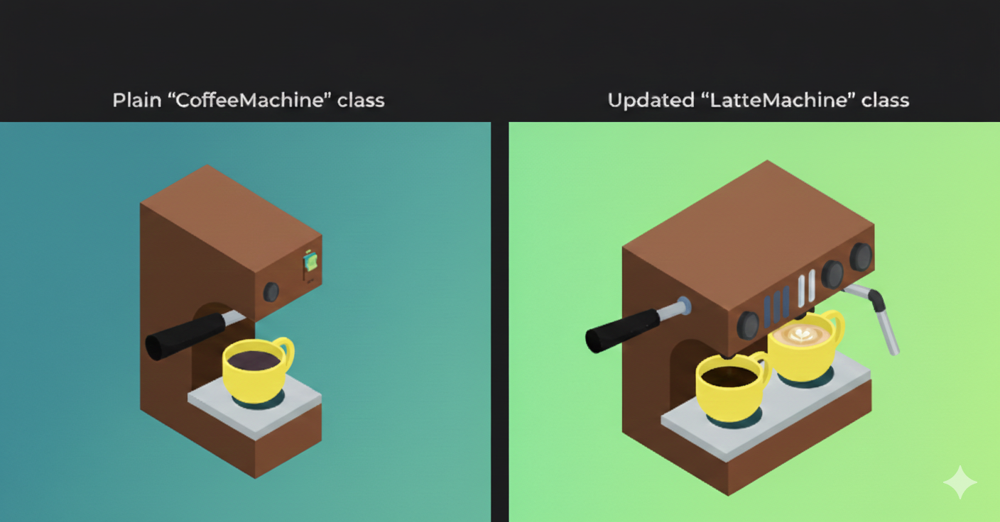

# Liskov Substitution Principle

**"A child class should be able to be used in place of its parent class without breaking its behaviour."**

Lets start with an improper example:

```Python
class CoffeeMachine:
    def brew(self):
        return "Brewing coffee..."

    def add_milk(self):
        return "Adding milk..."
```

Then we generate two more subclasses from it:

```Python
class EspressoMachine(CoffeeMachine):
    pass

class FilterCoffeeMachine(CoffeeMachine):
    def add_milk(self):
        raise Exception("Filter coffee machine does not support milk? (it should not :/ )")
```

Lets try to make Latte:

```Python
class make_latte(machine: CoffeeMachine):
    machine.brew()
    machine.add_milk()
```

This function expects a `CoffeeMachine`.
If we pass `EspressoMachine` there is no problem, but if give `FilterCoffeeMachine` the shop will explode (boom). Because the child class breaks the rule and rebels.

The problem is `FilterCoffeeMachine` is derived from `CoffeeMachine` but it does not support `add_milk` functionality. This violates LSP because a child class should fulfill the contract of its parent class functionalities and be fully substitutable for it. A filter coffee machine is a coffee machine, right?

**Lets fix this** now by adding an interface (interface segregation):

```Python
    class MilkAddable:
        def add_milk(self):
            return "Adding milk..."

    class CoffeeMachine:
        def brew(self):
            return "Brewing coffee..."

    class EspressoMachine(CoffeeMachine, MilkAddable):
        pass

    class FilterCoffeeMachine(CoffeeMachine):
        pass 
```

We only accept machines that can add milk now:

```Python
# Classical multiple inheritance solution
class LatteMachine(CoffeeMachine, MilkAddable):
    pass

def make_latte(machine: LatteMachine):
    machine.brew()
    machine.add_milk()
```

**OR**

```Python
# more flexible and modern solution by behavioral-based type safety
from typing import Protocol

class LatteCapable(Protocol):
    def brew(self) -> str: ...
    def add_milk(self) -> str: ...

def make_latte(machine: LatteCapable):
    machine.brew()
    machine.add_milk()
```

