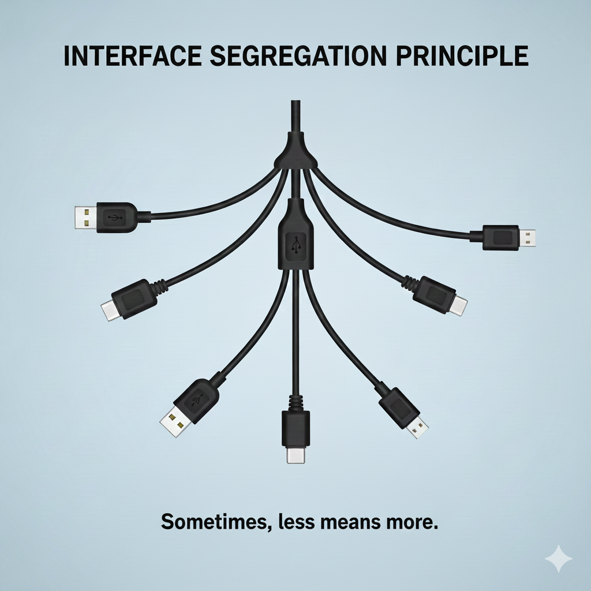

# Interface Segregation Principle

**"Instead of cramming all responsibilities into one interface, split them into multiple, more specialized interfaces"**

This prevents classes from being forced to implement methods they don't need.  
  
Imagine a six-armed coffee robot in a shop that makes all kinds of coffee, squeezing juices, and even washing dishes. Having to implement so much functionality in one place means that even if one small, unrelated component breaks, it could disrupt entire machine and halt the operations.

```Python
from abc import ABC, abstractmethod

class ICoffeeMachine(ABC):
    @abstractmethod
    def boil_water(self):
        pass

    @abstractmethod
    def pull_shot(self):
        pass

    @abstractmethod
    def brew_filter_coffee(self):
        pass

    @abstractmethod
    def brew_turkish_coffee(self):
        pass
    
    @abstractmethod
    def add_milk(self):
        pass
    
    @abstractmethod
    def extract_juice(self):
        pass

class MastrenaMKIV(ICoffeeMachine):
    pass
```  

We have created a *fat interface*. A somewhat simple Espresso machine is forced to implement `extract_juice` which it will never use.

Let's make it logical now:

```Python
from abc import ABC, abstractmethod

class Brewable(ABC):
    @abstractmethod
    def boil_water(self):
        pass
    
    @abstractmethod
    def brew_filter_coffee(self):
        pass


class TurkishCapable(ABC):
    @abstractmethod
    def brew_turkish_coffee(self):
        pass


class MilkAddable(ABC):
    @abstractmethod
    def add_milk(self):
        pass


class EspressoCapable(ABC):
    @abstractmethod
    def pull_shot(self):
        pass


class MastrenaMKIV(EspressoCapable, MilkAddable):
    pass


class TurkishCoffeeMachine(TurkishCapable):
    pass
```

This way we segregated the interfaces and liberated them from having to implement all functionalities that it will not need.